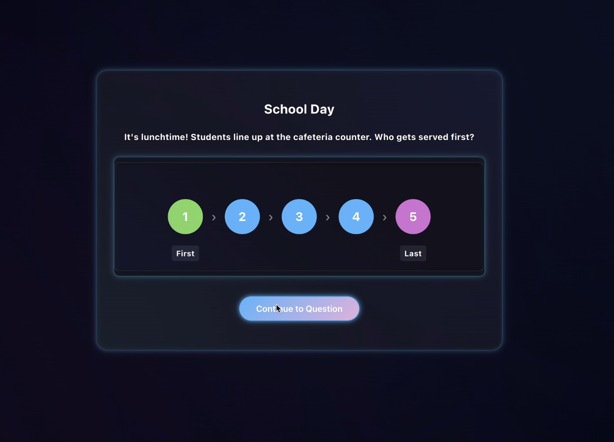

# 🏆 Innovation Hacks 2025 Winner!

We won the Innovation Hacks 2025 hackathon with this project.

**Project Members:** Vidit Patel, Swayam Mehta, Aayush Parikh, Sharvari Joshi

---

# cmd-play

A retro terminal-inspired arcade for educational games!

Deployed Link : https://cmd-play-fo13.vercel.app/

PPT : https://www.canva.com/design/DAGlJmxNq-0/Wo2o85-RFYjPMxT2cYRCxA/view?utm_content=DAGlJmxNq-0&utm_campaign=designshare&utm_medium=link2&utm_source=uniquelinks&utlId=h1af352a9e6

## Overview

**cmd-play** is a unified hackathon project featuring a terminal-style launcher and a suite of interactive games for learning programming, cybersecurity, and problem-solving. Inspired by classic terminals, it brings together fun, education, and nostalgia in one place.

---

## 🎮 Game Flow

1. **Start at the Terminal**  
   Users are greeted with a retro terminal interface. Type `help` to see available commands and games.  
*Example:*

2. **Play Cybersecurity Game: Whack-a-Hack**  
   Launch "Whack-a-Hack" to practice spotting cyber threats in a Whack-a-Mole style game.  
*Example:*

3. **Learn Coding Concepts: Flappy Bird**  
   Play "Flappy Bird" and answer coding questions to keep flying!  
*Example:*

4. **Master Data Structures: DataStruct Quest**  
   Solve interactive data structure puzzles and challenges.  
*Example:*

5. **Become a Database Detective**  
   Solve mysteries using SQL queries in "Database Detective".  
*Example:*

---

*Tip: Each game can be launched directly from the terminal interface by typing the game name. Progress, scores, and hints are shown in real-time!*

### Included Games
- **Cyber Catcher**: A Whack-a-Mole style cybersecurity awareness game.
- **Flappy Bird**: Classic Flappy Bird clone for arcade fun.
- **DataStruct Quest**: Solve puzzles and challenges about data structures.
- **Database Detective**: Solve a crime using SQL queries and database logic.

## How It Works
- Launch the terminal interface (`game-terminal`)
- Type commands to list, launch, or get help on games
- Each game runs on its own port for easy access

## Quick Start
1. Clone the repository and install dependencies for each subproject.
2. Use `start-games.sh` to launch all games and the terminal at once.
3. Open http://localhost:5173 to access the terminal and start playing!

## Project Structure
- `game-terminal/` — Terminal-style launcher (React + Vite)
- `cyber-catcher-vite/` — Cybersecurity Whack-a-Mole (React + Vite)
- `DataStruct-Quest/` — Data structure puzzle game (React + Vite)
- `flappy-bird/` — Flappy Bird clone (HTML/JS)
- `sql-murder-mystery/` — SQL-based detective game (React + Vite)
- `start-games.sh` — Script to launch all servers

## Contributing
Pull requests and suggestions welcome! See each subproject for setup and contribution details.

## License
MIT License (see each subproject for details)
